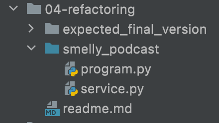

# Your turn: Refactoring

## Objectives

1. Use the various refactorings to "fix" bad code

We are going to use a project (located in the same folder as this file) called `smelly_podcast` (as in code smells). This is code we used to download some things from Talk Python To Me.

It has been contorted to have many problems or [code smells](https://en.wikipedia.org/wiki/Code_smell). We'll use refactoring to freshen this up.

**Note**: Before you first run this app, you'll need to make sure you have `requests` installed via pip.

## Large method *smell*

Look at `program.py` and notice this somewhat complex app is actually just one big method, yuck. We'll use several refactoring to fix this.

First, notice the section with the comment **"SHOW THE HEADER"**.

Take that small piece of code and make it its own method. Highlight the lines, choose **Refactor > Refactor this**.

Choose method and name it `show_header()`. Notice it was created below and called from your current location.

After each refactoring, run the program to make sure it still works!

(It should :) ).

Next, make a method out of **"DOWNLOAD THE EPISODE DATA"**. Name it `download_data`.

Next up, we have **"GET LATEST SHOW ID"**. We want a method that will return that value. So highlight just  `max(episode_data.keys())` in the line:

```latest_show_id = max(episode_data.keys())```

Choose extract method again. Notice that this time, PyCharm found another usage (duplicate code!) we can replace that with this method call too (automatically).

Choose a good name, like `get_latest_show_id`.

Now find the single line annotated with **"GET EPISODE"**. Highlight only this in the line: `episode_data.get(show_id)` and refactor it to a method called `get_episode`.

Finally, notice the remaining section label **"DISPLAY RESULTS"**.

Highlight that and extract it to `display_results()`.

Rerun your program (again, and again). It's still working right? OK then, carry on.

## Large module *smell*

Our code is MUCH better already. But let's separate the usage of this functionality from it's implementation. We'll move the parts to do with downloading and parsing episodes to `service.py`.

Let's move the data container and type first. Highlight these two lines and "move" them via refactoring to `service.py`.

	Episode = namedtuple('Episode', 'title link pubdate show_id')
	episode_data = {}  

**Note**: If you have **not** opened just the `smelly_podcast` folder as the project root, you will need to market that folder as a sources root for that to work. It should look like this:



Open `service.py` and see that the lines have moved. Does your code still run?

We need to move some of the methods. Namely, move these all to service. Before you do it one by one, observe that you can move multiple things at once. Highlight one to move, choose move, and check the others off before agreeing to move them to `service.py`.

* `get_episode`
* `get_latest_show_id`
* `download_data`

Now that is slick, right? Does your code still run?

## Variable absence *smell*

Variable absence is something I just made up. Couldn't find a smell for it named. Here's the deal. What does this mean:

`result = 7 * max(inputs) * (match / count)`

Let's try this one instead.

```python
largest_cell = max(inputs)
ratio = (match / count)
DICE_MULTIPLIER= 7

result = DICE_MULTIPLIER * largest_cell * ratio
```

Well, you'll still have to use your imagination. But it seems to do with a board game, rolling dice, etc. Why is one clear and the other isn't? The expression is computing many values inline. Once named, they are much clearer what they are and how they are combined.

Open `service.py`. Notice this line `dom.findall('channel/item')` appears multiple times. It represents the `items` from the RSS feed. 

Make a variable for it by highlighting either single expression, choose refactor > variable. Name it something like `items`. Choose 2 locations!

Does your code still run? Then you're done. :)

*See a mistake in these instructions? Please [submit a new issue](https://github.com/talkpython/mastering-pycharm-course/issues) or fix it and [submit a PR](https://github.com/talkpython/mastering-pycharm-course/pulls).*